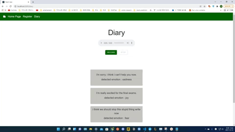

# How's Your Day? (CS492I) 📖
------------------------------------
- We aim to replace `second-level authentication` with `voice-verficiation` along which an user is asked to write an `emotional diary`.
- With `voice-verification`, we also detect `multi-modal emotion detection` from `speech` and `text` (extracted with `speech recognition module`, `vosk`), possibly providing different UIs/suggestions in the future along with the detected emotion.
- With this end, we also aim to help user to record their status everyday, and `provide mental clinical provision`, if negative emotions are consistently observed. 

Below are the brief description of each directory, and please refer to `README.md` of each directory for more information.

#### APP 📱
----
This directory contains backend/frontend service.

## How to Use APP
1. Register yourself with Recorded voice, Username, Password
  

  
2. Move to Diary page
  

  
3. Record short sentence with Recoder.
  

  
4. Analyzed text and emotion will be recorded.
  

  

#### Speech Recognition 👂
---
For `Speech Recognition`, we used a pretrained Vosk model to convert speech to text.

#### Speaker Verifcation 🔒
---
For `Speaker Verification`, we used a d-vector approach with GE2E Loss to verify the identity of the speaker.

#### TER (Text Emotion Recognition) ✍️
---
For `TER`, we aimed to use bert based TEXT-only module to classify the emotion.

#### SER (Speech Emotion Recognition) 🗣️
---
For `SER`, we aimed to use wac2vec2 based SPEECH-only module to classify the emotion.

#### MM (Multimodal Emotional Recognition) 📠
----
For `MM`, we implemented the multimodal (audio + text) emotion classifier, adopting each module from `TER` and `SER`.\
This multimodal approach generalizes best with our testing datasets.
**(63.33% for dataset A, 53.33% for dataset B, 63.63% for IEMOCAP)**
